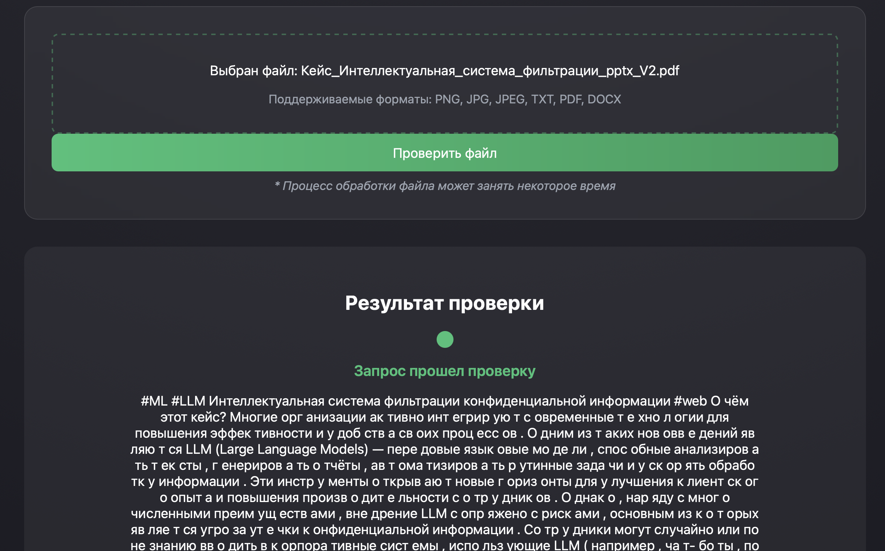
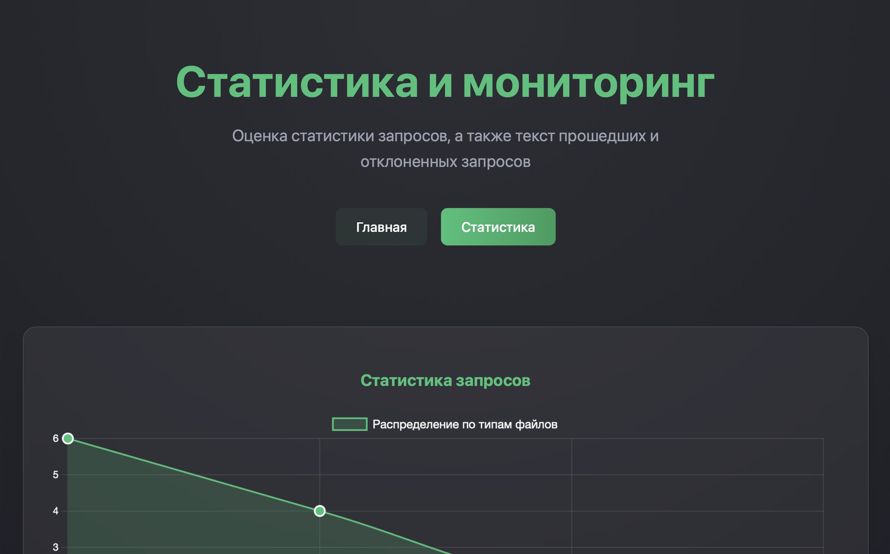

# Решение по кейсу -  Интеллектуальная система фильтрации конфиденциальной информации 

### Решение:

В качетсве итогового продукта у нас получилось разработать полноценное **product ready** приложение для фильтрации конфиденциальной информации. Сервис быстро и эффективно блокирует любые попытки ввода конфиденциальной информации в корпоративные системы, использующие LLM, как в текстовом формате, так и через файлы.

  

### 🎯 Ключевые особенности:

- ✨ Поддержка множества форматов файлов (PDF, DOCX, TXT, PNG, JPG)
- 🔍 OCR-распознавание текста в изображениях
- 📊 Детальная статистика и мониторинг
- 🚀 Высокая производительность обработки
- 🔒 Надежная защита конфиденциальных данных

### Структура проекта:

<pre>

📦 app
 ┣ 📂 backend
 ┃ ┣ 📂 routers
 ┃ ┃ ┣ 📜 __init__.py
 ┃ ┃ ┣ 📜 queries.py         # API для статистики и запросов
 ┃ ┃ ┣ 📜 items.py          # Обработка файлов и текста
 ┃ ┃ └ 📜 users.py          # Управление пользователями
 ┃ ┣ 📜 main.py             # Основной файл FastAPI
 ┃ ┣ 📜 models.py           # SQLAlchemy модели
 ┃ ┣ 📜 database.py         # Конфигурация БД
 ┃ └ 📂 uploads             # Директория загрузок
 ┣ 📂 frontend
 ┃ ┣ 📂 static
 ┃ ┃ ┣ 📂 css              
 ┃ ┃ ┣ 📂 js               
 ┃ ┃ └ 📂 images           
 ┃ └ 📂 templates
 ┃   ┣ 📜 index.html       # Главная страница
 ┃   ┣ 📜 demo.html        # Демо-страница
 ┃   └ 📜 stat.html        # Страница статистики
 ┣ 📂 docs                  # Документация и скриншоты
 ┗ 📜 requirements.txt      # Зависимости проекта

</pre>

### Основные компоненты:

#### Backend
- **main.py** - Центральный файл приложения, содержащий основную логику и конфигурацию FastAPI
- **models.py** - Определение моделей данных с использованием SQLAlchemy
- **database.py** - Настройка подключения к базе данных
- **routers/** - Модули маршрутизации для разделения логики:
  - queries.py - Обработка запросов и статистики
  - users.py - Управление пользователями
  - items.py - Работа с элементами

#### Frontend
- **static/** - Статические файлы (CSS, JavaScript)
- **templates/** - HTML шаблоны для рендеринга страниц

<h3>🚀 Нажмите, чтобы увидеть список реализованного функционала</h3>

- **Полноценное API** - Разработан полный набор эндпоинтов для работы с системой:
  - Загрузка и обработка файлов различных форматов (PDF, DOCX, TXT, изображения)
  - Проверка текста на наличие конфиденциальной информации
  - Система рейтинга пользователей
  - Статистика использования системы

- **Обработка файлов** - Реализована поддержка различных форматов:
  - PDF документы
  - Microsoft Word (DOCX)
  - Текстовые файлы (TXT)
  - Изображения (PNG, JPG, JPEG) с OCR-распознаванием текста

- **Система статистики и мониторинга**:
  - Отслеживание успешных/неуспешных запросов
  - Статистика по типам загружаемых файлов
  - Рейтинговая система пользователей
  - Временные метрики (день/неделя/месяц)

- **База данных**:
  - Хранение информации о пользователях
  - История запросов
  - Статистика использования
  - Рейтинги пользователей

- **Безопасность**:
  - Валидация входных данных
  - Проверка форматов файлов
  - Обработка ошибок и исключений

- **Frontend**:
  - Полноценное веб приложение с интерфейсом для загрузки файлов
  - Панель для просмотра общей статистики
  - Интерактивные графики и таблицы
  - Страница для демонстрации обработки сообщений

<h3>Нажмите, чтобы посмотреть изображения</h3>

  

  

  

## Запуск Docker образа
